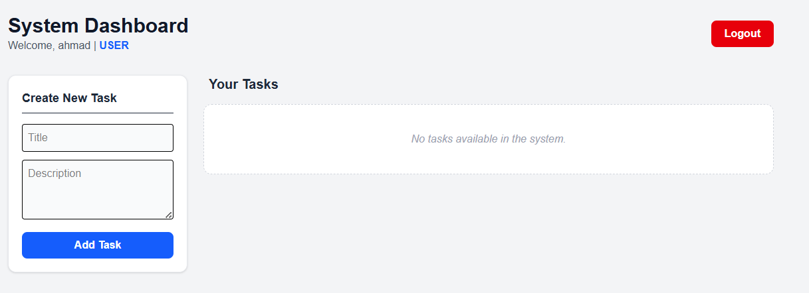
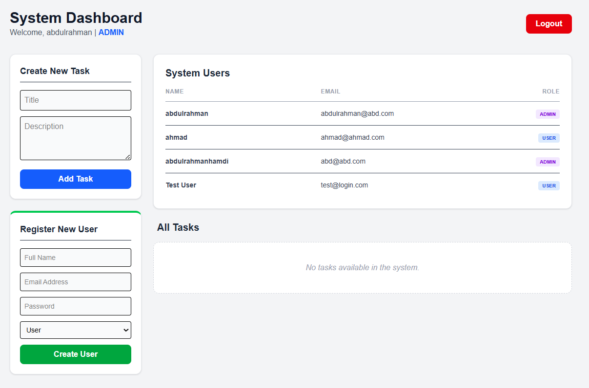

# TaskFlow – Full-Stack Task Management System

TaskFlow is a production-style full-stack Task Management System built with Laravel and Next.js. The project demonstrates clean architecture, role-based access control, and a clear separation between administrative system management and end-user task organization.

The system consists of:
- An Admin Dashboard powered by Filament for managing users and tasks.
- A User Portal built with Next.js for personal task management.
- A REST API secured with Laravel Sanctum for frontend-backend communication.

This project was implemented to satisfy a technical full-stack assessment, focusing on structure, logic, and real-world patterns rather than visual complexity.

---

## Overview

TaskFlow provides a simple yet complete task workflow:

- Administrators manage users and oversee all tasks.
- Regular users manage only their own tasks.
- Tasks move through clear states: Pending, In Progress, Completed.
- Authentication and authorization are enforced at the backend level.

The architecture emphasizes separation of concerns, scalable design, and secure API-driven communication.

---
## Demo Video

A short walkthrough demonstrating both the User Dashboard and Admin Panel functionality.

Watch Demo: [Click here to watch](./screenshots/demo.mp4)

---

## Project Structure

Backend (Laravel + Filament)
- REST API
- User and Task management
- Role-based access (Admin / User)
- MySQL database

Frontend (Next.js)
- User dashboard
- Task CRUD operations
- Status management
- API integration via Axios

---

## Features

### Admin Capabilities (Filament + API)

- User Management
  - Create users
  - Update users
  - List all users

- Task Oversight
  - View all tasks in the system
  - Create, edit, delete any task
  - Assign tasks to users

- Role-Based Access
  - Only admins can access the Filament panel
  - Authorization enforced on the backend


### User Capabilities (Next.js)

- Personalized Dashboard
  - Users see only tasks they created or were assigned

- Dynamic CRUD
  - Create tasks
  - Edit tasks
  - Delete tasks

- Status Tracking
  - Pending
  - In Progress
  - Completed

All interactions are performed through the API with real-time UI updates.

---

## Tech Stack

Backend
- Laravel 11
- Filament v3
- MySQL

Frontend
- Next.js 14
- Tailwind CSS
- Axios

Authentication
- Laravel Sanctum (Bearer Token)

---

## Installation and Setup

### Backend (Laravel)

```bash
cd backend
composer install
cp .env.example .env
# Update database credentials inside .env
php artisan migrate --seed
php artisan serve
```


### Frontend (Next.js)

```bash
cd frontend
npm install
# Set NEXT_PUBLIC_API_URL to your Laravel backend URL
npm run dev
```

Make sure the backend server is running before starting the frontend.

---

## Security Architecture

- Authentication handled using Laravel Sanctum with Bearer Tokens.
- Custom AuthGuard ensures protected API routes.
- Axios interceptors automatically attach tokens and redirect unauthenticated users to login.
- Role-based logic is enforced on the backend to prevent unauthorized access to admin resources.

Frontend authorization is treated as UX only; backend remains the single source of truth.

---

## API Capabilities

The backend exposes a simple REST API for:

- Listing tasks
- Creating tasks
- Updating tasks
- Deleting tasks

These endpoints are consumed directly by the Next.js frontend.

---

## Design Philosophy

- Clean separation between Admin and User experiences
- Backend-driven authorization
- Simple, readable structure
- No unnecessary abstractions
- Focus on correctness and maintainability

---

## Screenshots

### User Dashboard



### Admin Panel (Filament)



---

## Author

Abdulrahman Hamdi  
Computer & AI Engineer

GitHub: https://github.com/abdulrahmanhamdi


